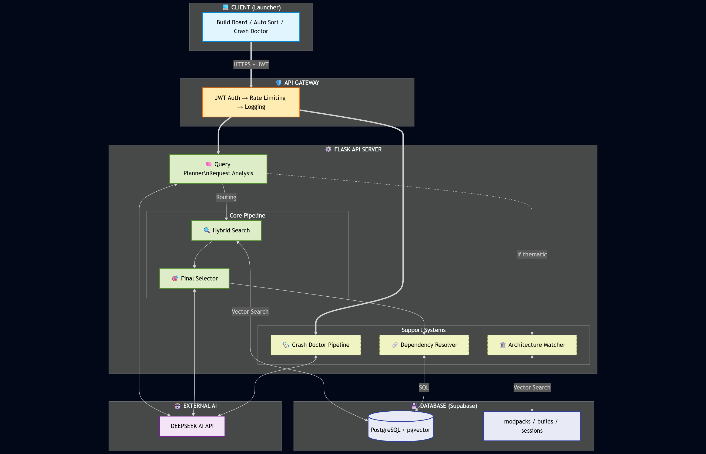
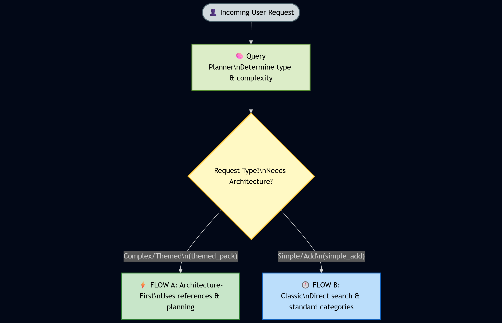
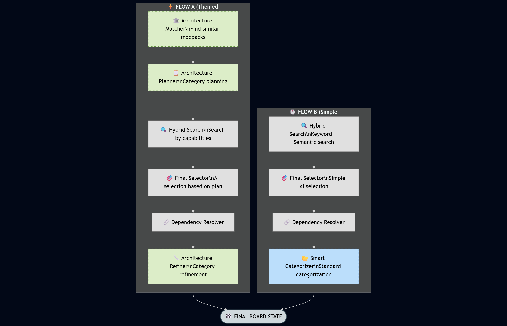

# 🚀 ASTRAL AI - Intelligent Minecraft Modpack Builder API

[](https://www.python.org/downloads/)
[](https://flask.palletsprojects.com/)
[](LICENSE)
[]()

> AI-powered system for intelligent Minecraft modpack creation with semantic search, dependency resolution, and crash analysis.

**⚠️ IMPORTANT**: This repository is for **PORTFOLIO AND DEMONSTRATION PURPOSES ONLY**. The code is proprietary and not available for use, modification, or distribution without explicit permission.

---

## 🎯 **Project Overview**

ASTRAL AI is a production-grade REST API that leverages Large Language Models (DeepSeek) and semantic search to create intelligent, optimized Minecraft modpacks. The system analyzes user prompts, searches a database of 100,000+ mods, and generates balanced modpacks with automatic dependency resolution.

**Key Innovation:** Architecture-first planning combined with capability-based search, resulting in coherent modpacks that match user intent while maintaining technical compatibility.

---

## ✨ **Core Features**

### 🤖 **AI Modpack Builder**
- **Natural Language Processing**: Users describe their ideal modpack in plain English
- **Architecture Planning**: AI creates a structured plan with categories and mod targets
- **Semantic Search**: Vector embeddings (sentence-transformers) for mod discovery
- **Smart Selection**: DeepSeek LLM balances relevance, compatibility, and diversity
- **Automatic Dependency Resolution**: Resolves 30-50 dependencies per modpack with conflict detection

### 🩺 **Crash Doctor** (Autonomous AI Agent)
- **Intelligent Crash Analysis**: Parses crash logs, identifies root causes
- **Automated Fix Planning**: Suggests mod removals, updates, or configuration changes
- **Modrinth Integration**: Validates mod availability and versions in real-time
- **Board State Patching**: Generates fixed modpack configurations
- **Learning System**: Stores analysis sessions for continuous improvement

### ⚡ **Performance & Scalability**
- **SSE Streaming**: Server-Sent Events for real-time progress updates (bypasses Cloudflare 100s timeout)
- **Rate Limiting**: Per-user token tracking with Supabase integration
- **Subscription Tiers**: Free, Premium, Pro with usage limits
- **Caching**: In-memory log cache for duplicate detection
- **Optimized Queries**: Batch database operations, pre-filtered searches

---

## 🏗️ **Architecture Highlights**

### System Overview

<p align="center">
  
</p>

**High-level architecture** showing:
- **Client** (Tauri launcher) → **API Gateway** (JWT auth, rate limiting)
- **Flask API Server** with core pipeline (Query Planner → Hybrid Search → Final Selector)
- **Support Systems**: Crash Doctor, Dependency Resolver, Architecture Matcher
- **External Services**: DeepSeek AI LLM
- **Database**: Supabase (PostgreSQL + pgvector) storing mods, modpacks, builds, sessions

---

### Request Flow & Decision Logic

<p align="center">
  
</p>

**Query Planner** analyzes incoming requests and determines:
- **FLOW A (Themed/Complex)**: Architecture-first approach with reference learning
  - Used for: "Create a medieval magic modpack"
  - Features: Semantic modpack search, capability pattern extraction, category planning
- **FLOW B (Simple/Add)**: Direct search with standard categorization
  - Used for: "Add sodium and lithium"
  - Features: Quick keyword + semantic search, simple categorization

---

### Dual Pipeline Architecture

<p align="center">
  
</p>

**Side-by-side comparison** of two pipelines:

**FLOW A (Architecture-First)**:
1. **Architecture Matcher**: Finds similar modpacks via semantic search
2. **Architecture Planner**: Plans categories based on reference patterns
3. **Hybrid Search**: Searches by capabilities (required + preferred)
4. **Final Selector**: AI selects mods to fit planned architecture
5. **Dependency Resolver**: Adds required dependencies
6. **Architecture Refiner**: Organizes final mods into refined categories

**FLOW B (Classic)**:
1. **Hybrid Search**: Direct keyword + semantic search
2. **Final Selector**: Simple AI selection
3. **Dependency Resolver**: Adds dependencies
4. **Smart Categorizer**: Standard categorization (Performance, Graphics, Gameplay, etc.)

Both flows output a **final board_state.json** ready for the launcher.

---

## 🧠 **Technical Deep Dive**

### **Semantic Search Implementation**
- **Model**: `sentence-transformers/all-MiniLM-L6-v2` (384-dim embeddings)
- **Database**: PostgreSQL with pgvector extension
- **Indexing**: HNSW index for fast approximate nearest neighbor search
- **Query Expansion**: AI generates 5-6 semantic queries per user request

### **Capability System**
- **80+ capabilities** mapped to mods (e.g., `magic.spellcasting`, `automation.core`, `combat.system`)
- **Hierarchical structure**: `category.subcategory` format
- **Dynamic filtering**: Required vs Preferred capabilities for flexible matching

### **Architecture-First Planning**
- **Innovation**: Instead of selecting mods first, AI plans modpack structure
- **Reference Learning**: Analyzes existing modpacks via semantic similarity
- **Category-Based Search**: Fills each category with appropriate mods
- **Result**: Coherent modpacks with balanced distribution

### **Crash Doctor Pipeline**
```python
Crash Log → Sanitization → AI Analysis (DeepSeek) 
          → Fix Planning (Modrinth validation)
          → Board Patching → Session Recording
```

**Key Features:**
- **Log Sanitization**: Removes PII, extracts mod list and error traces
- **AI Analysis**: Identifies root cause, problematic mods, error types
- **Fix Validation**: Checks Modrinth for mod availability and versions
- **Smart Patching**: Applies fixes to board_state.json without breaking structure

---

## 🚀 **API Endpoints**

### **Modpack Builder**
```http
POST /api/ai/build-board
Content-Type: application/json
Authorization: Bearer <JWT>

{
  "prompt": "Create a performance-optimized tech modpack",
  "mc_version": "1.20.1",
  "mod_loader": "forge",
  "max_mods": 150,
  "current_mods": [],
  "fabric_compat_mode": false
}
```

**Response**: SSE stream with progress updates + final `board_state.json`

### **Crash Doctor**
```http
POST /api/ai/crash-doctor/analyze
Content-Type: application/json
Authorization: Bearer <JWT>

{
  "crash_log": "<crash log content>",
  "board_state": { /* current board state */ },
  "game_log": "<game log content>",
  "mc_version": "1.20.1",
  "mod_loader": "forge"
}
```

**Response**: SSE stream with suggestions + patched `board_state.json`

---

## 📊 **Performance Metrics**

| Metric | Value |
|--------|-------|
| **Average build time** | 2-4 minutes |
| **AI calls per build** | 5-7 (Query Planner, Architecture Planner, Final Selector, etc.) |
| **Cost per build** | ~$0.003 USD (DeepSeek pricing) |
| **Mods searched** | 100,000+ |
| **Dependency resolution** | 30-50 dependencies per modpack |
| **Crash analysis time** | 30-60 seconds |

---

## 🛠️ **Tech Stack**

- **Backend**: Flask 3.0, Python 3.11+
- **AI**: DeepSeek LLM (GPT-compatible API)
- **Embeddings**: sentence-transformers, Hugging Face
- **Database**: PostgreSQL + Supabase (pgvector, RLS)
- **Vector Search**: pgvector with HNSW indexing
- **Authentication**: Supabase Auth (JWT)
- **Deployment**: Cloudflare Tunnel, Waitress WSGI server

---

## 📚 **Documentation**

**Visual Architecture**: All architecture diagrams are available in [`docs/images/`](docs/images/)

For detailed technical documentation, contact via Discord or email.

---

## 🎓 **Learning & Innovation**

### **Why This Project is Unique**

1. **Architecture-First Approach**: Unlike traditional mod search tools that match keywords, ASTRAL AI plans the entire modpack structure before selecting mods

2. **Capability-Based Search**: 80+ structured capabilities allow precise matching beyond simple tags

3. **Reference Learning**: System learns from 5,000+ existing modpacks to understand what works

4. **Autonomous Crash Analysis**: Crash Doctor operates as an AI agent with multiple specialized tools (log parsing, Modrinth API, board patching)

5. **Production-Ready**: Handles real users with rate limiting, authentication, error recovery, and monitoring

---

## 🔮 **Future Development**

- [ ] **MCP Migration**: Convert Crash Doctor to Model Context Protocol for true autonomous operation
- [ ] **Feedback Loop**: Integrate user feedback to improve mod selection
- [ ] **Server Pack Generator**: Automatically filter client-side mods for server deployments
- [ ] **Multi-Loader Support**: Better handling of Fabric ↔ NeoForge compatibility
- [ ] **Cost Optimization**: Cache common queries, reuse embeddings

---

## 📄 **License**

**Proprietary License - All Rights Reserved**

This repository is for **portfolio demonstration only**. Viewing for educational/review purposes is permitted, but:

- ❌ NO copying, modification, or redistribution
- ❌ NO commercial use
- ❌ NO derivative works

See [LICENSE](LICENSE) for full terms.

**Note**: Backend API architecture is showcased here. Frontend launcher code is separate and also proprietary.

---

## 🤝 **About This Repository**

This is a **portfolio showcase project** demonstrating:
- Production-grade AI system design
- Advanced architectural patterns
- Real-world problem solving

The code is shared publicly to demonstrate technical capabilities to potential employers, collaborators, and the developer community.

**Not accepting contributions.** This is a personal portfolio project.

---

## 👤 **Author**

**Your Name**
- LinkedIn: [Your Profile]
- GitHub: [@YourUsername](https://github.com/YourUsername)
- Website: [astral-ai.online](https://astral-ai.online)

---

## 🙏 **Acknowledgments**

- **Modrinth**: Mod metadata and downloads
- **DeepSeek**: AI model for analysis and planning
- **Su5eD**: Fabric Compatibility Mode technology (Connector/Sinytra)
- **Supabase**: Database and authentication infrastructure

---

<p align="center">
  <b>⭐ Star this repo if you find it interesting!</b>
</p>
